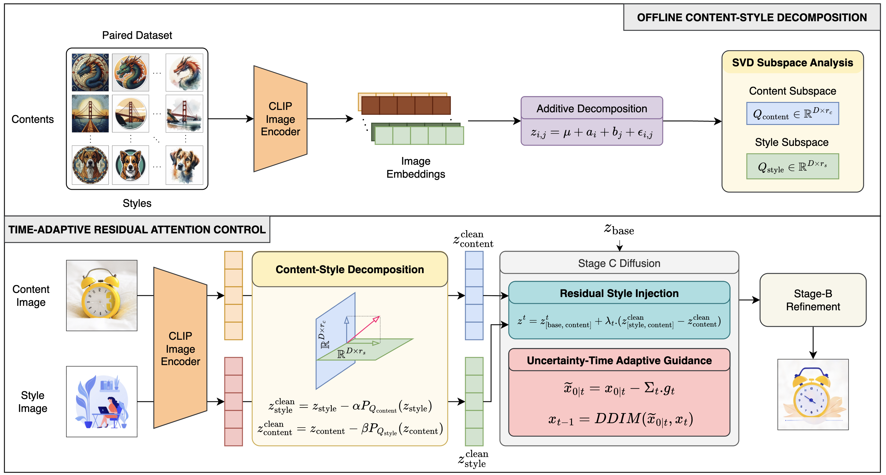
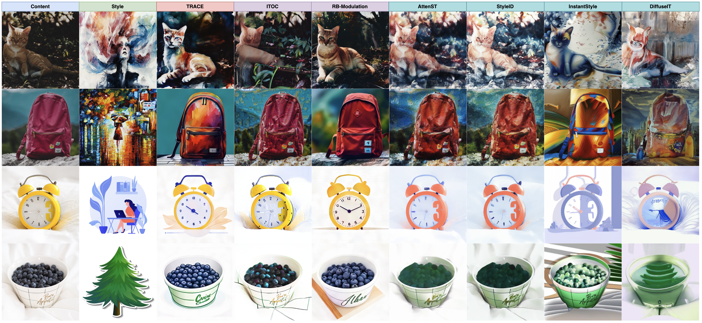

<h1 align="center">TRACE: Time-Adaptive Residual Attention Control with Content–Style Decomposition for Training-Free Diffusion Style Transfer</h1>

<p align="center">
  <b>Duc Khoan Le</b><sup>1,2</sup>,
  <b>Kim Ngoc Tran</b><sup>1,2</sup>,
  <b>Minh Nhat Le</b><sup>1,2</sup>,
  <b>Thanh An Tran</b><sup>1,2</sup>,
  <b>Viet Toan Nguyen</b><sup>1,2</sup>,
  <b>Khanh An Lay</b><sup>1,2</sup>,
  <b>Tran Thai Son</b><sup>1,2</sup>,
  <b>Hoang Pham Minh</b><sup>1,2</sup>
</p>

<p align="center">
  <sup>1</sup> <i>Faculty of Information Technology, University of Science, Ho Chi Minh City, Vietnam</i><br>
  <sup>2</sup> <i>Vietnam National University, Ho Chi Minh City, Vietnam</i>
</p>

<p align="center">
  
  <a href="."></a>
  
  <a href="LICENSE"></a>
</p>

---

## 🔥 News

- **Accepted at ACCV 2026**: TRACE has been accepted for presentation at ACCV 2026.
- **2026.10.03**: The TRACE paper is now available on [arXiv](.).
- **2026.10.03**: The official TRACE code has been released!

---

## 🧭 Overview

**TRACE** is a training-free framework for reference-guided diffusion style transfer. It is designed to balance three competing objectives: **style fidelity**, **content preservation**, and **content leakage suppression**.

Instead of treating stylization as a static feature-transfer operation, TRACE formulates the reverse diffusion process as a controlled trajectory and combines three components:

- 🧩 **Content–Style Decomposition:** learns content and style subspaces from paired CLIP embeddings to disentangle content from style in both references.
- 🎨 **Residual Style Injection:** injects a cleaned style residual additively rather than directly replacing the content-preserving attention trajectory.
- 📈 **Uncertainty-Time Adaptive Guidance:** estimates the reliability of the current denoising state and adaptively adjusts the style-guidance strength across reverse diffusion steps.

<p align="center">
  
</p>

## 🎨 Qualitative Results

TRACE is compared with both stylization-oriented and optimal-control-based methods. Stylization methods often provide stronger appearance transfer but may distort content structure or introduce semantic information from the style reference, while optimal-control-based methods preserve content more conservatively but exhibit weaker stylization. TRACE aims to balance these two behaviors.

<p align="center">
  
</p>

## ⚙️ Installation

Run the following commands from the repository root:

```bash
# Create and activate the environment
conda create -n trace python=3.9 -y
conda activate trace

# Download pretrained Stable Cascade models
cd third_party/StableCascade/models
bash download_models.sh essential big-big bfloat16
cd ..

# Install Stable Cascade dependencies
pip install -r requirements.txt
pip install opencv-python matplotlib ftfy
cd ../..
```

### 📦 Pretrained CSD Weights

Download the [pretrained CSD weights](https://drive.google.com/file/d/1FX0xs8p-C7Ob-h5Y4cUhTeOepHzXv_46/view) and place them at:

```text
third_party/CSD/checkpoint.pth
```

## 🚀 Usage

The pre-computed content–style decomposition described in the paper is provided at:

```text
decomposition/decomposition.pt
```

### 📂 Prepare Input Images

Place the content and style images under the `data/` directory:

```text
data/
├── content/
│   ├── content_01.jpg
│   ├── content_02.jpg
│   └── ...
└── style/
    ├── style_01.jpg
    ├── style_02.jpg
    └── ...
```

The content–style pairs used for inference are specified in `run_main.sh`. The content and style images are processed as corresponding pairs according to their order.

### ▶️ Run TRACE

To run the provided examples, simply execute:

```bash
bash run_main.sh
```

The generated images will be saved in the `samples/TRACE/` directory.

## 📚 Citation

If you find TRACE useful for your research, please consider citing our paper:

```bibtex
@inproceedings{le2026trace,
  title     = {TRACE: Time-Adaptive Residual Attention Control with Content-Style Decomposition for Training-Free Diffusion Style Transfer},
  author    = {Duc Khoan Le and Kim Ngoc Tran and Minh Nhat Le and Thanh An Tran and Viet Toan Nguyen and Khanh An Lay and Tran Thai Son and Hoang Pham Minh},
  booktitle = {Asian Conference on Computer Vision (ACCV)},
  year      = {2026}
}
```

## 🙏 Acknowledgements

Our implementation builds upon [StableCascade](https://github.com/Stability-AI/StableCascade) and [CSD](https://github.com/learn2phoenix/CSD). We thank the authors for sharing their code and pretrained models.